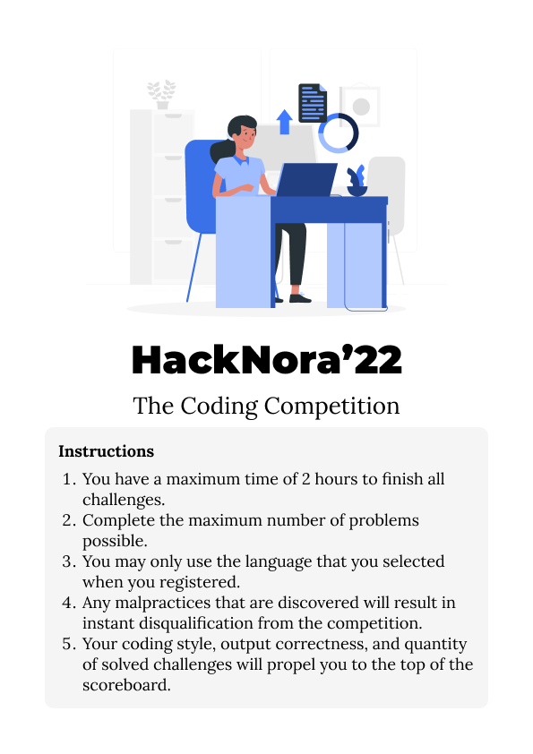
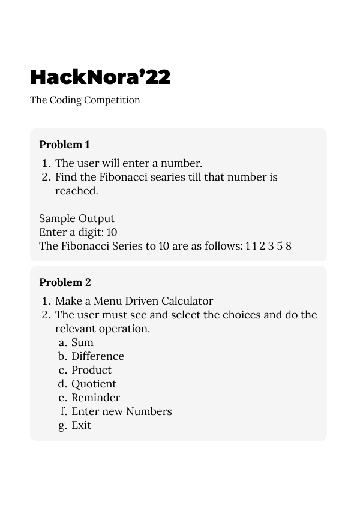
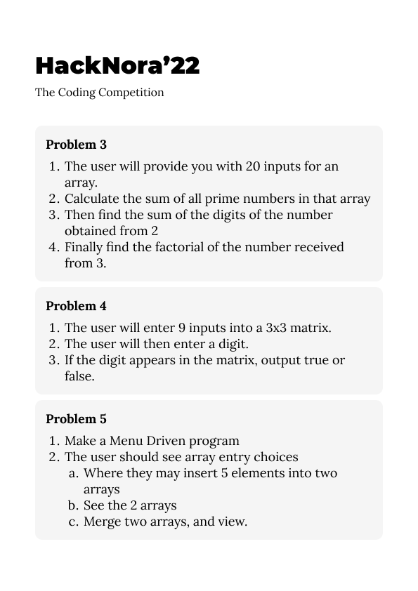
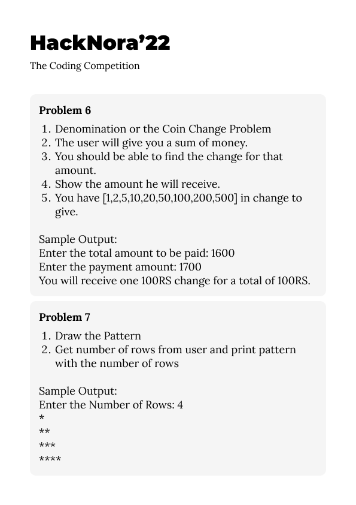

<<<<<<< HEAD
# HackNora
HackNora is a mini hackathon or a coding competition conducted by Department of Computer Science and Applications, SIAS during Techfest 2022

-----

# Questions

=======

>>>>>>> 51a9c40073e1123121804cab41bf262b7528f370
