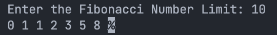

# 1. Print Fibonacci Series upto a limit

## Problem Statement

### Input
  - 10

### Output
  - 1 1 2 3 5 8
  

### Code

```c
#include <stdio.h>
int main() {
	int num, first = 0, second = 1, third;
	printf("Enter the Fibonacci Number Limit: ");
	scanf("%d", &num);
	for (int i = 0; i <= num; i++) {
		if (first >= num) {
			break;
		} else {
			printf("%d ", first);
			third = first;
			first = second;
			second = third + first;
		}
	}
	return 0;
}

```

## Output

