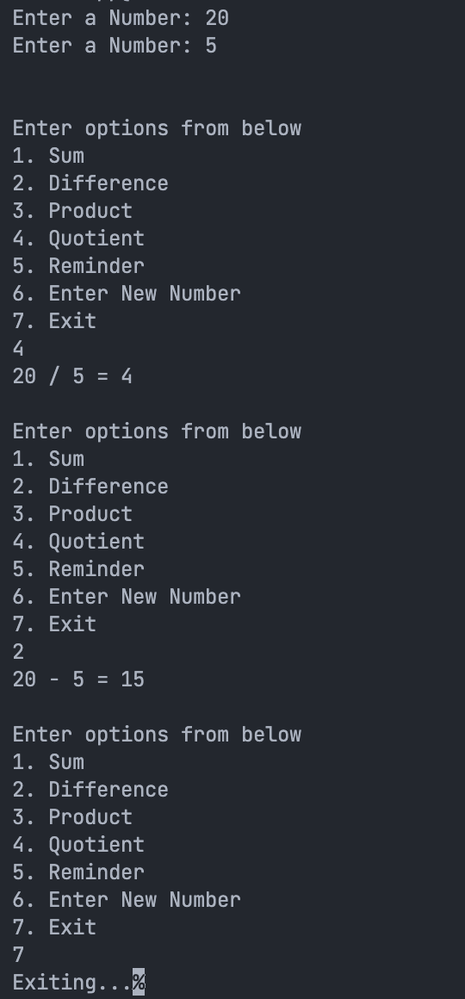

# 2. Menu Driven Calculator

## Problem Statement

Code should ask 2 user inputs. and show menu to user asking for choice. 1 to add, 2 to subtract, 3 to multiply, 4 to divide, 5 to find remainder of firstNumber / secondNumber, 6 to enter new numbers, 7 to exit. Code shouldn't exit until or unless user enters 7.
  

### Code

```c
#include<stdio.h>

#include <stdlib.h>

void sum(num1, num2) {
	printf("%d + %d = %d", num1, num2, num1 + num2);
}

void difference(num1, num2) {
	printf("%d - %d = %d", num1, num2, num1 - num2);
}

void product(num1, num2) {
	printf("%d * %d = %d", num1, num2, num1 * num2);
}

void quotient(num1, num2) {
	printf("%d / %d = %d", num1, num2, num1 / num2);
}

void reminder(num1, num2) {
	printf("reminder of %d / %d = %d", num1, num2, num1 % num2);
}

int get_number(num) {
	printf("Enter a Number: ");
	scanf("%d", & num);
	return num;
}

void main() {
	int repeat = 1, option, num1, num2;
	num1 = get_number(num1);
	num2 = get_number(num2);
	while (repeat == 1) {
		printf("\n\nEnter options from below\n");
		printf("1. Sum\n");
		printf("2. Difference\n");
		printf("3. Product\n");
		printf("4. Quotient\n");
		printf("5. Reminder\n");
		printf("6. Enter New Number\n");
		printf("7. Exit\n");
		scanf("%d", & option);
		switch (option) {
			case 1:
				sum(num1, num2);
				break;
			case 2:
				difference(num1, num2);
				break;
			case 3:
				product(num1, num2);
				break;
			case 4:
				quotient(num1, num2);
				break;
			case 5:
				reminder(num1, num2);
				break;
			case 6:
				num1 = get_number(num1);
				num2 = get_number(num2);
				break;
			case 7:
				printf("Exiting...");
				exit(0);
				break;
			default:
				break;
		}
	}
}

```

## Output

