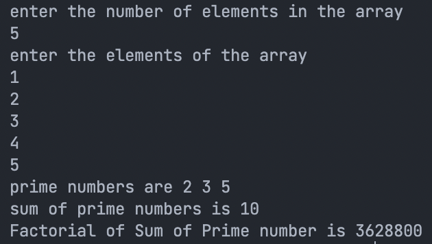

# 3. Prime and Factorial from an Arra

## Problem Statement

User will enter limit of an array, and some numbers into the Array. Code should find the prime numbers and the factorial of the numbers.

### For Example

let an array be declared with atleast space of 50. User will enter the limit and the numbers into the array. You have to find all prime numbers and show those prime. Find the sum of all prime and print them. Find the factorial of the sum of primes and print it.
  

### Code

```c
#include<stdio.h>

int prime(int n) {
	int i, flag = 0;
	for (i = 2; i <= n / 2; i++) {
		if (n % i == 0) {
			flag = 1;
			break;
		}
	}
	if (flag == 0)
		return 1;
	else
		return 0;
}

int factorialOfSum(int n) {
	int i, factorial = 1;
	for (i = 1; i <= n; i++) {
		factorial = factorial * i;
	}
	return factorial;
}

int main() {
	int i, j, n, sum = 0;
	printf("enter the number of elements in the array\n");
	scanf("%d", & n);
	int a[n];
	
	printf("enter the elements of the array\n");
	
	for (i = 0; i < n; i++) {
		scanf("%d", & a[i]);
	}
	
	printf("prime numbers are ");
	
	for (i = 0; i < n; i++) {
		if (prime(a[i]) == 1 && a[i] > 1) {
			sum = sum + a[i];
			printf("%d ", a[i]);
		}
	}

	printf("\n");
	printf("sum of prime numbers is %d\n", sum);

	int fact = factorialOfSum(sum);
	printf("Factorial of Sum of Prime number is %d\n", fact);

	return 0;
}
```

## Output

