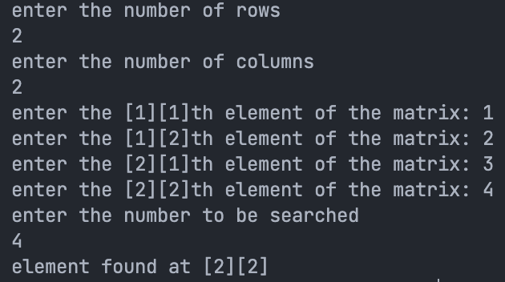

# 4. Matrix Search Operation

## Problem Statement

Get elements to a 3x3 matrix and search for a given element.


### Code

```c
#include<stdio.h>

int main() {
	int matrix[3][3], i, j, sum = 0, search, flag = 0;
	for (i = 0; i < 3; i++) {
		for (j = 0; j < 3; j++) {
			printf("enter the [%d][%d]th element of the matrix: ", i + 1, j + 1);
			scanf("%d", & matrix[i][j]);
		}
	}
	printf("enter the number to be searched\n");
	scanf("%d", & search);
	for (i = 0; i < 3; i++) {
		for (j = 0; j < 3; j++) {
			if (matrix[i][j] == search) {
				printf("element found at [%d][%d]\n", i + 1, j + 1);
				flag = 1;
			}
		}
	}
	if (flag == 0) {
		printf("element not found\n");
	}
	return 0;
}
```

## Output

