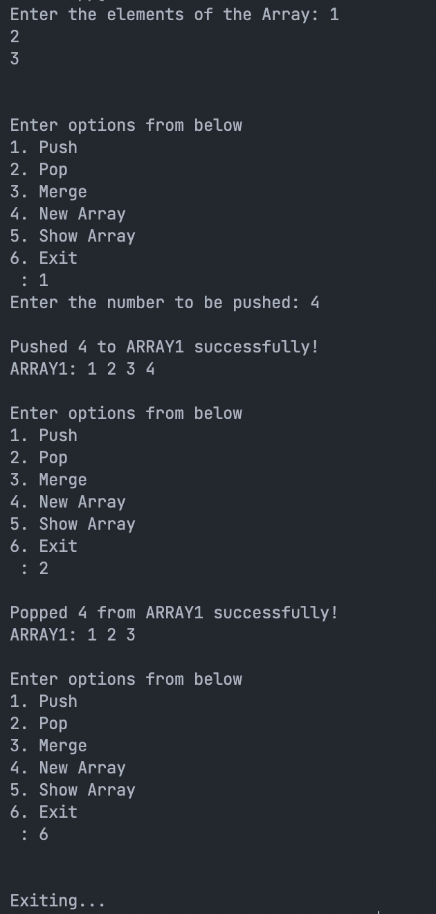

# 5. Menu driven Array Merge Operation

## Problem Statement

Get elements to a 3x3 matrix from user. Show options to user to perform 
1. push
2. pop
3. merge
4. New Array
5. Display Arrays
6. Exit

Code must not exit untill or unless user exit the code.

### Code

```c
#include<stdio.h>

int ARRAY1[100], ARRAY2[100], MERGEDARRAY[200], A1LIM, A2LIM;

void push(number) {
	ARRAY1[A1LIM] = number;
	A1LIM++;
	printf("\nPushed %d to ARRAY1 successfully!", number);
	printf("\nARRAY1: ");
	for (int i = 0; i < A1LIM; i++) {
		printf("%d ", ARRAY1[i]);
	}
}

void pop() {
	printf("\nPopped %d from ARRAY1 successfully!", ARRAY1[A1LIM]);
	A1LIM--;
	printf("\nARRAY1: ");
	for (int i = 0; i < A1LIM; i++) {
		printf("%d ", ARRAY1[i]);
	}
}

void show() {
	printf("\nARRAY1: ");
	for (int i = 0; i < A1LIM; i++) {
		printf("%d ", ARRAY1[i]);
	}
	printf("\nARRAY2: ");
	for (int i = 0; i < A2LIM; i++) {
		printf("%d ", ARRAY2[i]);
	}
	printf("\nMERGEDARRAY: ");
	for (int i = 0; i < A1LIM + A2LIM; i++) {
		printf("%d ", MERGEDARRAY[i]);
	}
}

void merge() {
	int i = 0, j = 0, k = 0;
	while (i < A1LIM && j < A2LIM) {
		if (ARRAY1[i] < ARRAY2[j]) {
			MERGEDARRAY[k] = ARRAY1[i];
			i++;
		} else {
			MERGEDARRAY[k] = ARRAY2[j];
			j++;
		}
		k++;
	}
	while (i < A1LIM) {
		MERGEDARRAY[k] = ARRAY1[i];
		i++;
		k++;
	}
	while (j < A2LIM) {
		MERGEDARRAY[k] = ARRAY2[j];
		j++;
		k++;
	}
	printf("Merged successfully!");
}

int main() {
	int i, flag = 0, option, number;
	printf("Enter the size of the Array array: ");
	scanf("%d", & A1LIM);
	printf("Enter the elements of the Array array: ");
	for (i = 0; i < A1LIM; i++) {
		scanf("%d", & ARRAY1[i]);
	}
	while (flag == 0) {
		printf("\n\nEnter options from below\n");
		printf("1. Push\n");
		printf("2. Pop\n");
		printf("3. Merge\n");
		printf("4. New Array\n");
		printf("5. Show Array\n");
		printf("6. Exit\n");
		scanf("%d", & option);
		switch (option) {
			case 1:
				printf("Enter the number to be pushed: ");
				scanf("%d", & number);
				push(number);
				break;
			case 2:
				pop();
				break;
			case 3:
				merge();
				break;
			case 4:
				printf("Enter the size of the Array array: ");
				scanf("%d", & A1LIM);
				printf("Enter the elements of the Array array: ");
				for (i = 0; i < A1LIM; i++) {
					scanf("%d", & ARRAY1[i]);
				}
				break;
			case 5:
				show();
				break;
			case 6:
				printf("\n\nExiting...\n");
				flag = 1;
				break;
		}
	}
	return 0;
}
```

## Output

