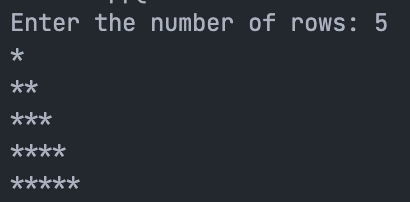

# 7. Trianlge of Stars

## Problem Statement

draw a triangle of stars with the number of rows input from the user

### Code

```c
#include<stdio.h>

int main() {
	int row = 0;
	printf("Enter the number of rows: ");
	scanf("%d", & row);
	for (int i = 1; i <= row; i++) {
		for (int j = 1; j <= i; j++) {
			printf("*");
		}
		printf("\n");
	}
}
```

## Output

